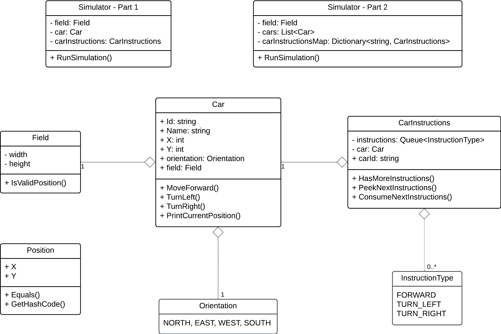
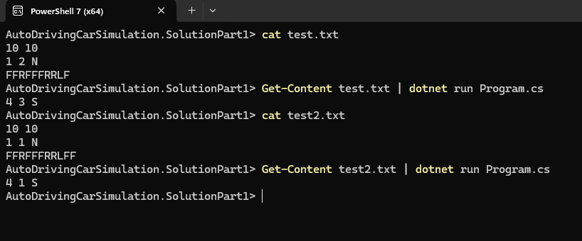
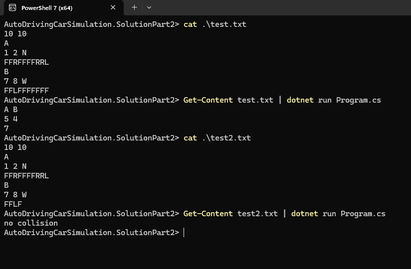
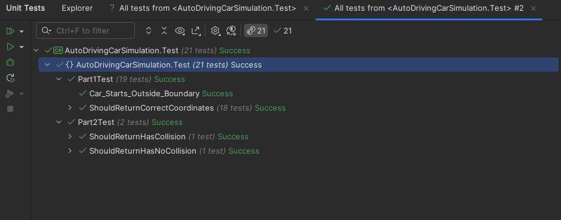

# Auto-Driving Car Simulation

### Introduction

#### 1. Environment
- All testing was conducted in a Windows environment.

#### 2. Folder Structure
1. AutoDrivingCarSimulation.Business
    - This is a class library containing the core classes used by both the Part 1 and Part 2 solutions.
2. AutoDrivingCarSimulation.SolutionPart1
    - This is a console application used for running the solution for Part 1.
3. AutoDrivingCarSimulation.SolutionPart2
    - This is a console application used for running the solution for Part 2.

### UML Diagram



Both solutions for parts 1 and 2 share the same set of classes (Field, Car, and CarInstructions). The Field class stores the boundary dimensions of the field, the Car class holds the car’s current position and defines its basic movement methods, and the CarInstructions class manages a queue of instructions for one car.

### Part 1 Solution

#### 1. How to run and test the program?

1. Go to the folder **AutoDrivingCarSimulation.SolutionPart1**
2. Open powershell in the current folder.
3. Run the following command
    - ```Get-Content test.txt | dotnet run Program.cs```



#### 2. Algorithm

The  algorithm processes a series of car-driving instructions and applies them sequentially to a car object. Each instruction instructs the car to either move forward or turn (left or right). The simulation continues until all instructions have been executed.

### Part 2 Solution

#### 1. How to run and test the program?

1. Go to the folder **AutoDrivingCarSimulation.SolutionPart2**
2. Open powershell in the current folder.
3. Run the following command
    - ```Get-Content test.txt | dotnet run Program.cs```



#### 2. Algorithm

1. Initialize simulation state
    - A step counter (step) is set to 1.
    - A result object is created to hold the outcome.

2. Main loop: Continue while there are instructions
    - The simulation continues as long as at least one car still has instructions pending.

3. Calculate next positions for all cars
    - Create a dictionary to map each car to its intended next position before actually moving the cars.

    For each car:
    - Check instructions: If a car has no remaining instructions, it stays in place.
    - Otherwise, peek the next instruction (without consuming it yet) to see what the car intends to do.

    Derive intended position based on the instruction.

4. Detect collisions in intended positions
    - Check if more than one car is mapped to the same next position.
    - If a collision is detected:
        - Retrieve the list of collided cars.
        - Terminate the simulation immediately by returning result (list of collided cars, collision position, step count).

5. No collision: Finalize each car's move
    - If no collision was found, consume the next instruction for each car that still has instructions.
    - Execute the actual movement/turning.

6. Increment step and repeat
    - The simulation step is incremented.
    - The loop continues until no cars have instructions left or until a collision is detected.

### Unit Tests

